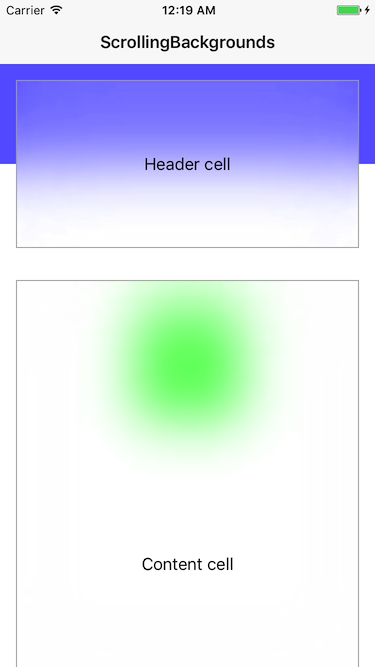

# ScrollingBackgrounds

## Description

[`BackgroundController`](ScrollingBackgrounds/BackgroundController.swift) allows to add background views to `UIScrollView`. Each background can have customized layout behaviour, so its position or size updates automatically when scrolling. You can use on of included layouts:

- [`TopBackgroundLayout`](ScrollingBackgrounds/TopBackgroundLayout.swift) - makes background stays on content top
- [`CenterBackgroundLayout`](ScrollingBackgrounds/CenterBackgroundLayout.swift) - centers the view in visible area
- [`BottomBackgroundLayout`](ScrollingBackgrounds/BottomBackgroundLayout.swift) - makes background stays on content bottom

or create your own by implementing [`BackgroundLayout`](ScrollingBackgrounds/BackgroundLayout.swift) protocol.

## Installation

You can integrate `ScrollingBackgrounds` with your project using [CocoaPods](https://cocoapods.org/). Just add this line to your Podfile:

    pod 'ScrollingBackgrounds', '~> 1.0'

## Usage

Check out included example iOS app project and Playground.

## License

Copyright © 2017 Dariusz Rybicki Darrarski

[MIT License](LICENSE). You are allowed to use the source code commercially, but licence and copyright notice MUST be distributed along with it.
